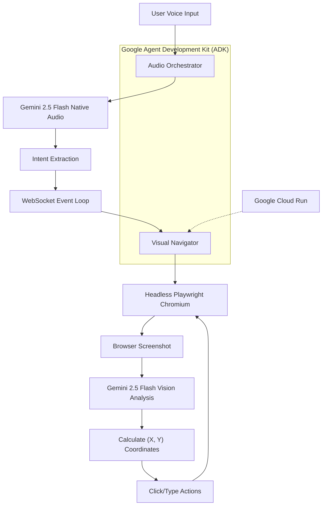
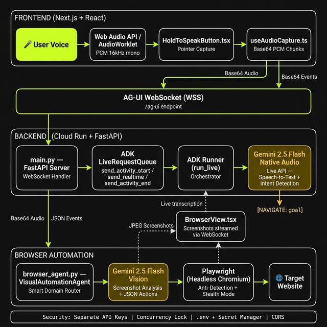

# IAN: Intelligent Accessibility Navigator


Voice-driven, autonomous web navigation powered by Gemini 2.5 Native Audio & Vision.

## Welcome
Welcome to the official repository for IAN! 👋

Navigating the modern web can be an absolute nightmare for visually impaired users. Traditional screen readers break the moment they hit a messy DOM or a cluttered e-commerce site. IAN fixes this by bypassing the code entirely. You speak naturally to our Neo-brutalist React dashboard, and IAN physically "sees" the screen and clicks through the browser for you using headless Chromium.

Built with blood, sweat, and Google Cloud credits for the Google Gemini Live Agent Challenge.

## Watch the Live Demo
[](https://www.youtube.com/watch?v=dLxiK394WOc&t=54s)

*Click the image above to watch the agent navigate Amazon autonomously!*

## Dual-Model Architecture
To prevent API rate limits and avoid blocking the WebSocket event loop, IAN splits the brain into two separate processes using the Google Agent Development Kit (ADK):

- **The Audio Orchestrator**: Streams live PCM audio to gemini-2.5-flash-native-audio to detect voice commands and extract the user's intent with zero-shot accuracy.
- **The Visual Navigator**: A background thread running headless Playwright that uses gemini-2.5-flash to analyze browser screenshots and calculate precise (X, Y) coordinates to click and type.

### Architecture Diagram
Since the original image link is broken or inaccessible, here's a text-based representation of the architecture using Mermaid for better rendering on GitHub:



This diagram illustrates the flow from user input through audio processing, intent extraction, and visual navigation in a looped browser interaction. If you have the original diagram details, it can be refined further.

## Currently Working On

| Optimization Focus | Details |
|--------------------|---------|
| **🛠️ Optimizing the Agent** <br> Right now, the focus is strictly on stability and hackathon delivery! <br> <ul><li>✅ Finalizing the <strong>Dual-Model Architecture</strong> to prevent API rate limits.</li><li>✅ Perfecting the <strong>AG-UI WebSocket Protocol</strong> for real-time Voice Activity Detection.</li><li>🔄 Scaling the Playwright visual agent loop on <strong>Google Cloud Run</strong>.</li><li>🔜 Adding support for multi-tab contextual memory.</li></ul> <br> [👉 <strong>Vote for us on Devpost!</strong>]([https://devpost.com/](https://devpost.com/software/ian-intelligent-accessibility-navigator)) |  |

## Tech Stack & Skills
Built with a thread-safe, non-blocking Python/React stack.

### The Brains
- Gemini 2.5 Flash (Native Audio & Vision)
- Google Agent Development Kit (ADK)

### The Brawn (Backend)
- Python
- Playwright for headless Chromium
- Google Cloud Run

### The Beauty (Frontend)
- React (Neo-brutalist dashboard)
- WebSocket for real-time communication
## 🛠️ Tech Stack
* **AI Models:** Gemini 2.5 Flash Native Audio, Gemini 2.5 Flash (Vision)
* **Frameworks:** Google GenAI SDK, Google Agent Development Kit (ADK)
* **Backend:** Python, FastAPI, WebSockets (AG-UI Protocol)
* **Browser Automation:** Playwright (Headless Chromium with Stealth Mode)
* **Frontend:** React, Next.js, Web Audio API
* **Cloud Infrastructure:** Google Cloud Run, Secret Manager

## ⚙️ How to Run Locally

### Prerequisites
* Python 3.11+
* Node.js 18+
* 2 separate Google Gemini API Keys (to separate audio/vision quotas)

### Backend Setup
1. Navigate to the backend directory: `cd backend`
2. Install dependencies: `pip install -r requirements.txt`
3. Install Playwright browsers: `playwright install chromium`
4. Create a `.env` file and add your keys:
   ```env
   GEMINI_API_KEY=your_audio_agent_key
   GEMINI_API_KEY_BROWSER=your_vision_agent_key
Start the server: uvicorn main:app --reload

Frontend Setup
Navigate to the frontend directory: cd frontend

Install dependencies: npm install

Start the development server: npm run dev

Open http://localhost:3000 and hold the green button to speak!

Built with ❤️ for the Gemini Live Agent Challenge 2026.


**To push the README:**
```bash
git add README.md
git commit -m "Add official project README and architecture diagram"
git push
```

## Establish Connection
Built by Zaynul Abedin Miah – Tech Community Leader & AI Developer.

Let's collaborate, talk about AGI, or build something awesome together!

[-000000?style=for-the-badge&logo=x&logoColor=ffffff)](https://x.com/azaynul123)
[](https://www.linkedin.com/in/zaynul-abedin-miah/)
[](https://www.facebook.com/azaynul123)

*"Stop parsing the DOM. Just look at the screen."*
